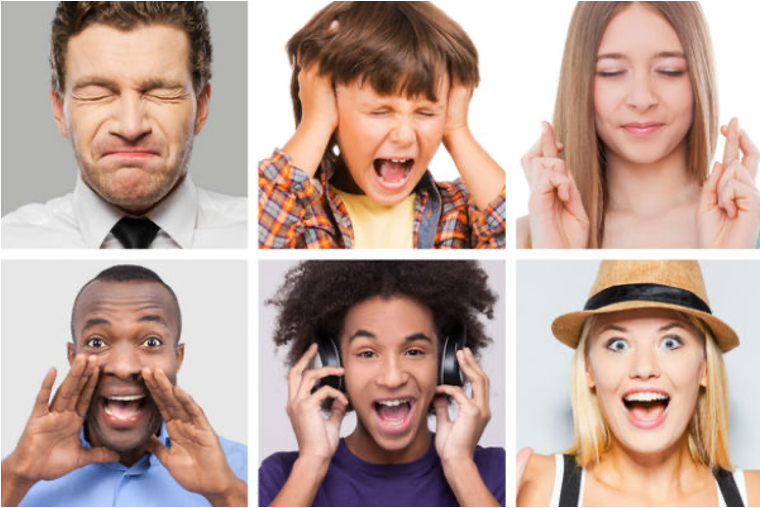
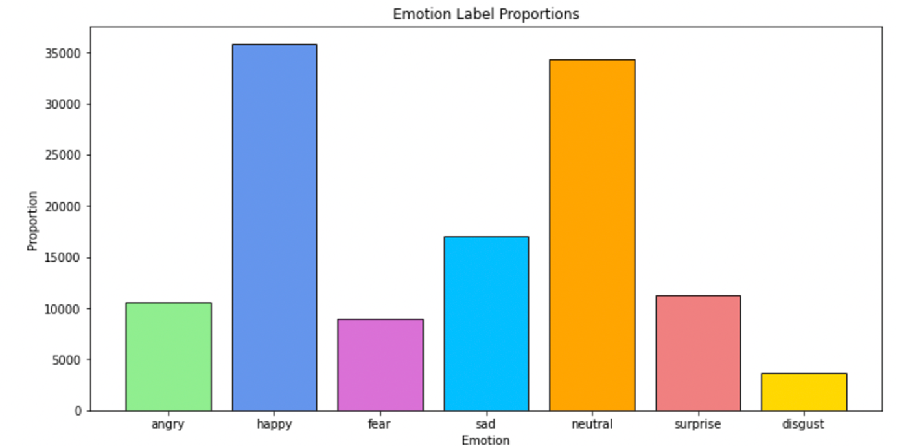

# Facial-Emotion-Recognition
##### Github Repository: Click [here]()
##### Presentation: Click [here]()
##### Authors: Justin Sohn



## Overview
Emotions are feelings that are very essential in people's life. It enables humans to comprehend themselves and communicate with one another, among other things. Emotions, above all, are mostly responsible for our ideas and actions. Knowing the Emotions of the customers/citizens in a company/service provider is an important factor in the success of this company as this measures the satisfaction of the customer/citizen for the services provided.

## Business Proposal
The goal is to know what feelings/emotions people are having to know their satisfaction based on their facial expressions. Knowing the emotions of the customers in a certain company/service provider is an important factor in the success of a company as this measures the satisfaction of the customer for the services provided. This will be done by deploying a model on a Flask web app that gets realtime/ live streaming video and  show the current emotion for each human from reading his/her face emotions.

## Data 
The data is from FER2013 dataset, it consists of 48x48 pixel grayscale images of faces. The faces have been automatically registered so that the face is more or less centered and occupies about the same amount of space in each image.



It is divided into train and test sets with seven common basic emotions (Happy, Neutral, Disgust, Surprise, Fear, Sad, Angry) proposed by Erkman (1992) one of the psychologist researchers. 
([Original Source](https://www.kaggle.com/msambare/fer2013))


## Models
Several models trained simple architectures of CNN, other models trained using multiple pre-trained models (VGG19, MobileNet & DenseNet 121) with different dropouts and also changed the number of layers of the CNN Architect. Applied some Data augmentation to improve the accuracies and prevent the model from overfitting. 

## Results & Evalutation 
We could see that the best model is the model of DenseNet 121 with imagenet weights and dropout 30% that gives the highest accuracy of 73.6% for training set and 64.5% for validation set and decreased the losses to 0.115 for training and 0.160 for validation set.

## Deployment
The model is deployed on a Flask web app that gets realtime/ live streaming video and shows the current emotion for each human from reading his/her face emotions.

## Recommendations 
- Check more different datsets such as MMA, CK+ to improve accuracies of the application
- Try other different techniques for face detection like Yolo other than OpenCV
- Deploy the app to a mobile app 

---

#### For more information
Please contact: 
[Justin Sohn](https://www.linkedin.com/in/justin-sohn-689901193/) 

**Repository Structure:**
```
├── chest_xray                             <- Data sourced externally and generated from code 
├── images                                 <- Images sourced externally and generated from code 
├── modeling-notebooks                     <- Notebooks on modeling 
├── .gitignore                             <- gitignore 
├── Final_Notebook.ipynb                   <- Narrative documentation of analysis in Jupyter notebook
├── README.md                              <- The top-level README for reviewers of this project
├── modelplotting.py                       <- Functions used for model plotting
└── tf_board_plotting.ipynb                <- Train-Validation plots for the presentation
