# Facial-Emotion-Recognition
##### Authors: Justin Sohn


## Overview
Emotions are feelings that are very essential in people's life. It enables humans to comprehend themselves and communicate with one another, among other things. Emotions, above all, are mostly responsible for our ideas and actions. Knowing the Emotions of the customers/citizens in a company/service provider is an important factor in the success of this company as this measures the satisfaction of the customer/citizen for the services provided.

## Business Proposal
The goal is to know what feelings/emotions people are having to know their satisfaction based on their facial expressions. Knowing the emotions of the customers in a certain company/service provider is an important factor in the success of a company as this measures the satisfaction of the customer for the services provided. This will be done by deploying a model on a Flask web app that gets realtime/ live streaming video and  show the current emotion for each human from reading his/her face emotions.

## Data 
The data is from FER2013 dataset, it consists of 48x48 pixel grayscale images of faces. The faces have been automatically registered so that the face is more or less centered and occupies about the same amount of space in each image.

It is divided into train and test sets with seven common basic emotions (Happy, Neutral, Disgust, Surprise, Fear, Sad, Angry) proposed by Erkman (1992) one of the psychologist researchers. 
([Original Source](https://www.kaggle.com/msambare/fer2013))


## Models
Several models trained simple architectures of CNN, other models trained using multiple pre-trained models (VGG19, MobileNet & DenseNet 121) with different dropouts and also changed the number of layers of the CNN Architect. Applied some Data augmentation to improve the accuracies and prevent the model from overfitting. 

Tried a baseline model with a built CNN Architect and the best accuracy for the training set was 63.5 % and 45.5% for the validation set while the losses are 1.028 for the training set and 1.517 for the validation set.

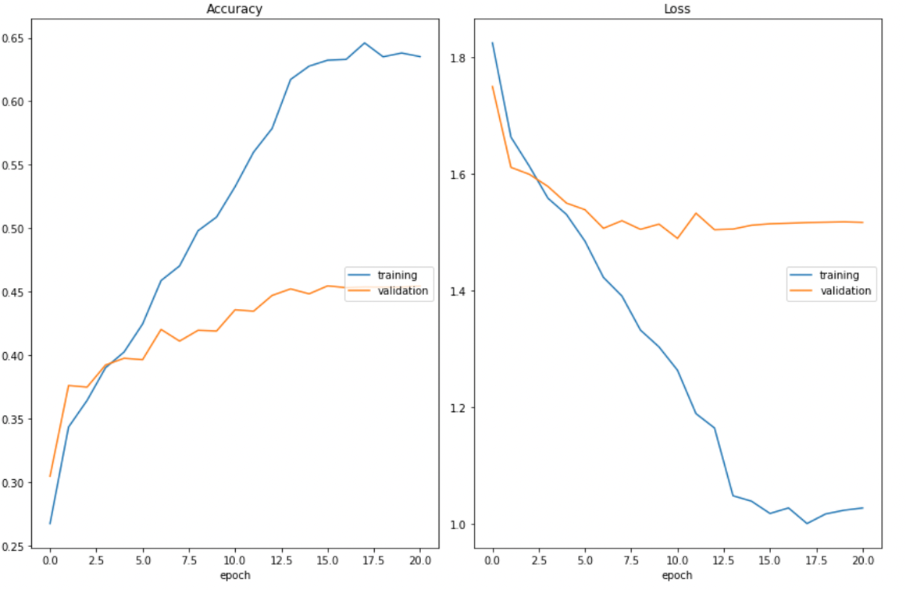

After data augmentation the accuracies increased for training by 49.4% and for validation 46.8% which shows that the results are enhanced and the overfitting is reduced also in the losses as they are 1.312 for training set and 1.387 for the validation test.

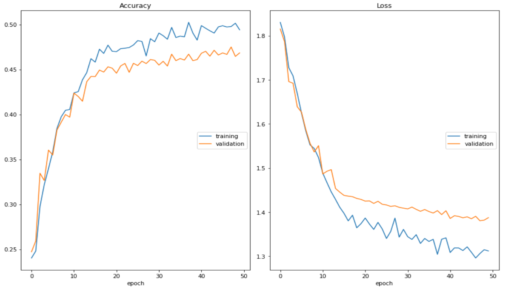

Tried to add more hidden layers in the CNN Architecture, which increased the accuracies for training set to be 94.1% and for validation set to be 56.5%, while the loss for training set is 0.356 while for the validation set is 1.745 which is still high so I decided to try the transfer learning models with pre-trained weights (imagenet).

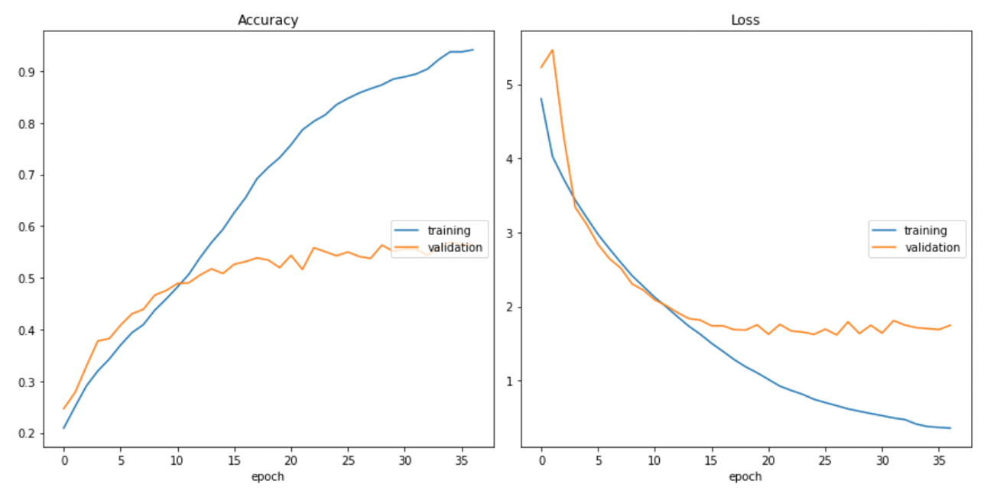

For the first transfer learning model, I trained a pre-trained model with a layer of VGG19 which shows that the accuracy didn’t increase for both the training and the validation sets.

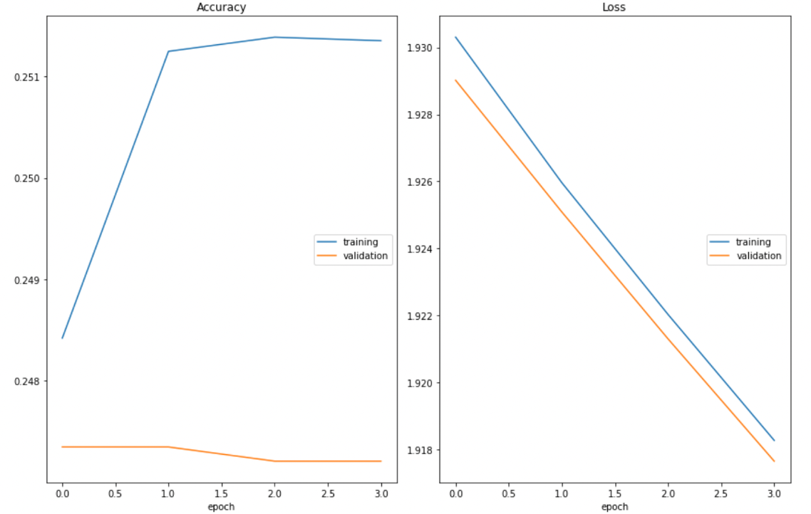

Trained a pre-trained model with a layer of DenseNet 121 which shows that the accuracy didn’t increase for both the training and the validation sets after many epochs although the loss decreased for both training and validation sets to 0.317 and 0.274 respectively.

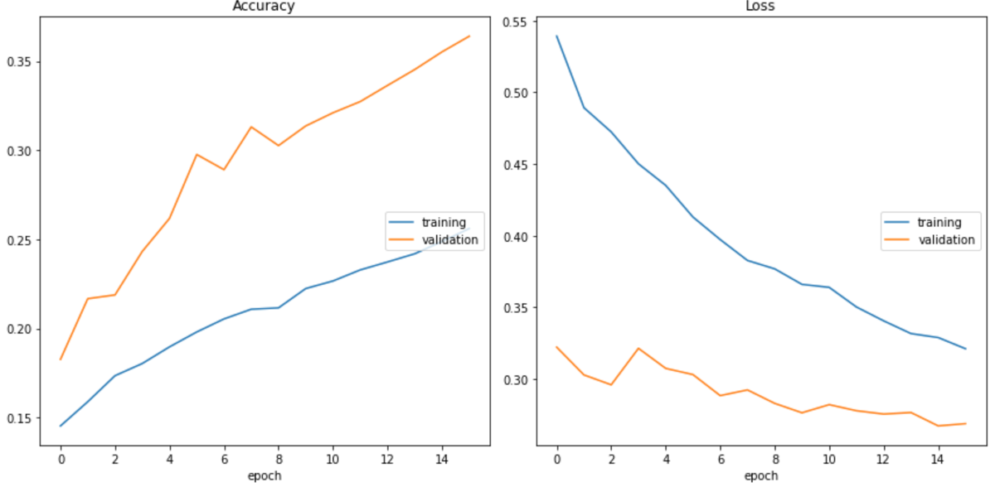

This is the MobileNet pre-trained model with decreasing the dropout to 30% which resulted in a good increase in the accuracies to 83.8% for training and 62% for validation set and also the loss is decreased to 0.077 for the training and 0.203 for the validation which are very good results for this dataset.

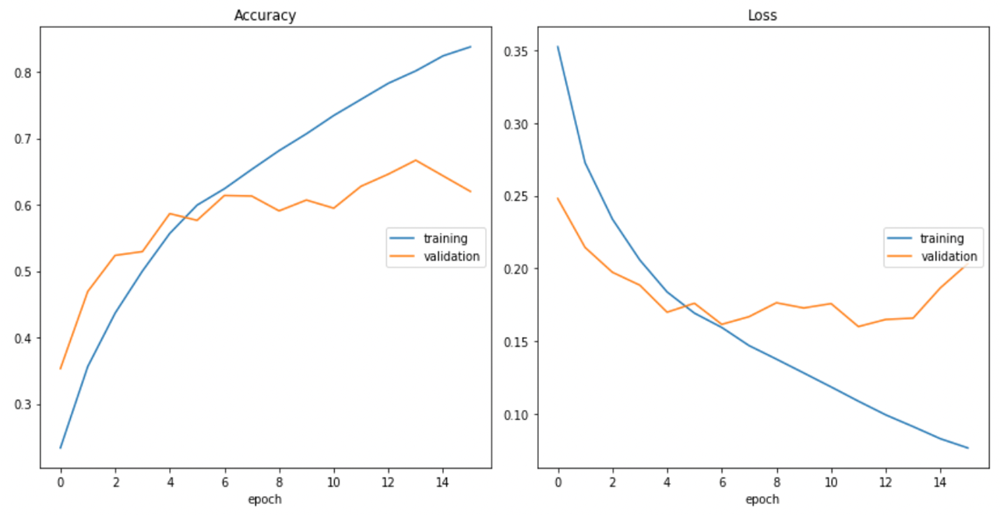

For the final model,tried the DenseNet 121  pre-trained model with the same decreased dropout of 30% which resulted in a good increase in the accuracies to 73.6% for training and 64.5% for validation set and also the loss is decreased to 0.115 for the training and 0.16 for the validation which shows better results than the other models.

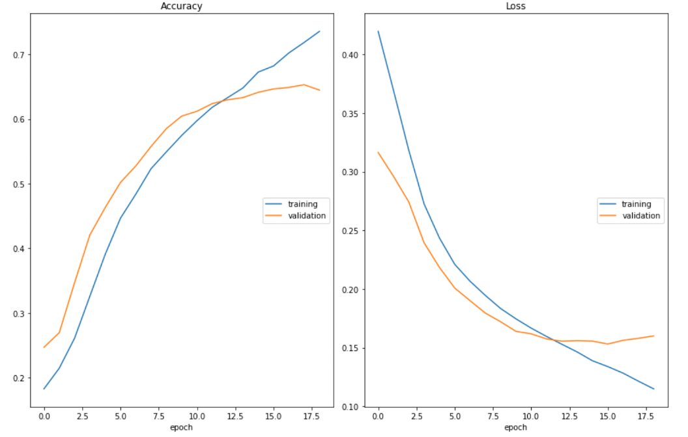

This is a confusion matrix for the best model. The class of happy emotion is the best predicted as it is much more than other classes, and the disgust emotion is the least as its number of images in the train and test sets are few compared to the other classes of emotions.

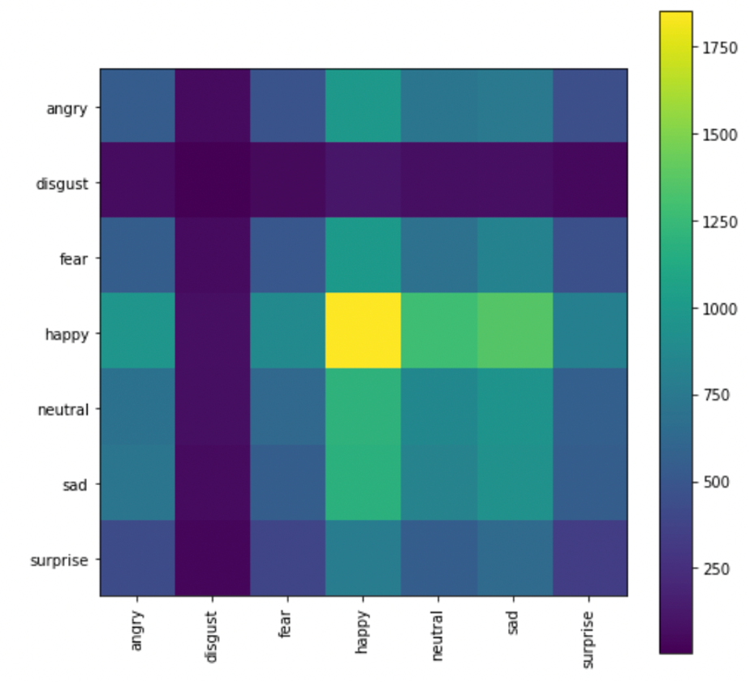

## Results & Evalutation 
We could see that the best model is the model of DenseNet 121 with imagenet weights and dropout 30% that gives the highest accuracy of 73.6% for training set and 64.5% for validation set and decreased the losses to 0.115 for training and 0.160 for validation set.

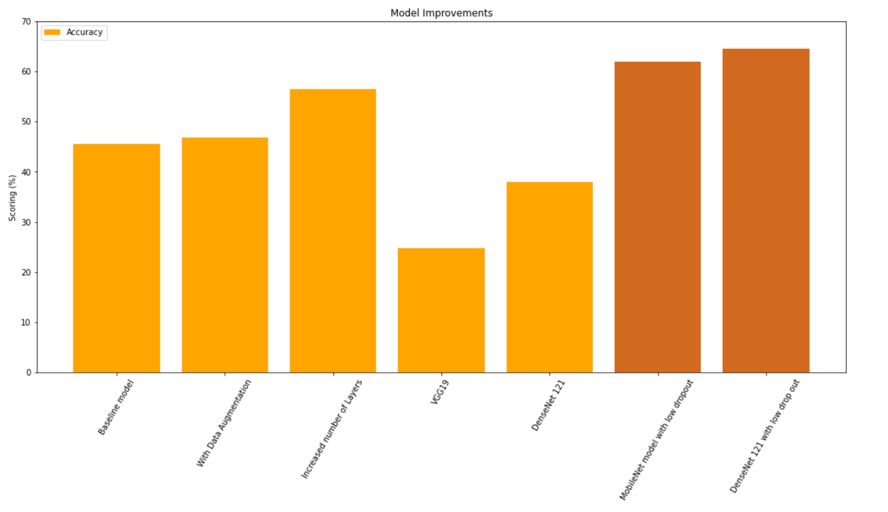

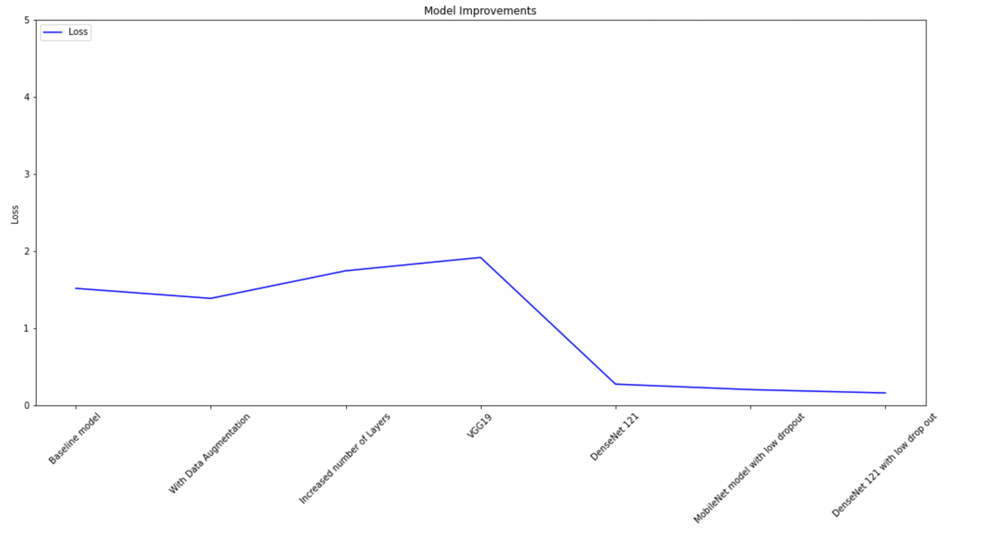

## Deployment
The model is deployed on a Flask web app that gets realtime/ live streaming video and shows the current emotion for each human from reading his/her face emotions.

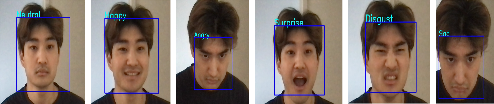

## Recommendations 
- Check more different datsets such as MMA, CK+ to improve accuracies of the application
- Try other different techniques for face detection like Yolo other than OpenCV
- Deploy the app to a mobile app 

---

#### For more information
Please contact: 
[Justin Sohn](https://www.linkedin.com/in/justin-sohn-689901193/) 

**Repository Structure:**
```
├── Flask app                              <- Files needed to run Flask app
├── images                                 <- Images sourced externally and generated from code 
├── .DS_Store                              <- .DS_Store
├── Presentation.pdf                       <- PDF version of project presentation
├── README.md                              <- The top-level README for reviewers of this project
├── final_jupyternotebook.ipynb            <- Narrative documentation of analysis in Jupyter notebook
├── model6.json                            <- Best Model 
└── model_weights6.h5                      <- Models stored to h5
